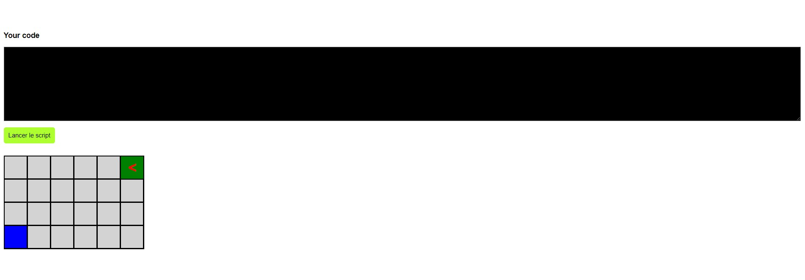

# Jeu du parcours 🏃‍♂️ 🏃‍♀️ 🚶‍♀️

Ce projet est un petit jeu de parcours dans lequel le joueur doit écrire un script pour guider un personnage du point de départ au point d'arrivée. Le joueur a trois commandes à sa disposition : "left" pour tourner à gauche, "right" pour tourner à droite et "move" pour avancer d'une case dans la direction actuelle. Le joueur écrit son script dans une zone de texte, puis appuie sur un bouton pour lancer le script. Le personnage exécute alors les commandes une par une jusqu'à atteindre le point d'arrivée ou sortir de la grille de jeu.

## Fonctionnalités

Grille de jeu aléatoire de 4 lignes sur 6 colonnes
Point de départ et point d'arrivée aléatoires
Commandes "left", "right" et "move"
Affichage du jeu à chaque tour
Vérification de la réussite ou de l'échec du parcours

## Utilisation

Pour jouer, il suffit de cloner ce dépôt Git et d'ouvrir le fichier index.html dans un navigateur web. Le jeu se lance automatiquement et une grille de jeu est affichée à l'écran avec le point de départ et le point d'arrivée. Le joueur doit écrire un script pour guider le personnage à travers la grille en utilisant les commandes "left", "right" et "move". Une fois le script écrit, le joueur clique sur le bouton "Lancer le script" pour commencer le parcours. Le jeu affiche alors la grille à chaque tour et le personnage exécute les commandes du script une par une. Si le joueur réussit à amener le personnage au point d'arrivée, une alerte de victoire s'affiche. Sinon, une alerte d'échec est affichée.

## Technologies utilisées

Ce projet a été développé en JavaScript, HTML et CSS, sans l'utilisation de bibliothèques ou de frameworks externes. Le code utilise des fonctions de manipulation du DOM pour afficher la grille de jeu et les alertes de victoire ou d'échec.

